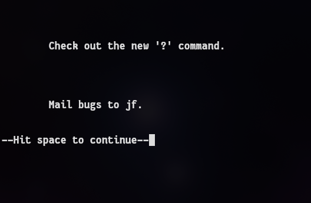
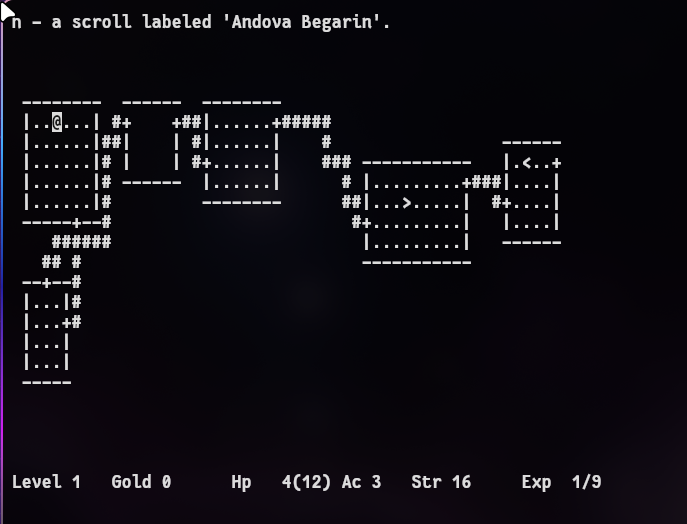

# protoHack

**Restoring Jay Fenlason's original 1982 Hack to run on modern Linux.**

protoHack applies the same preservation-first philosophy as
[restoHack](https://github.com/Critlist/restoHack), but to an earlier,
pre-distribution working tree. This source predates every currently known distributed
Hack variant. While restoHack restored the 1985 release, protoHack reaches
further back to the original 1981-82 codebase.


*"Mail bugs to jf." — Jay Fenlason's welcome message, running on a modern terminal in 2026.*


*Dungeon rendering and status line working. Note the scroll labeled "Andova Begarin" —
one of Fenlason's original randomized scroll names.*

## Lost and Found

This source was widely considered lost for over 40 years. Jay Fenlason put Hack on
the USENIX 82-1 distribution tape and, by his own account, "forgot about it."
By the time he
[spoke to Julie Bresnick in 2000](https://www.linux.com/news/train-life-nethacks-papa/),
he had long since moved on; he still played his original version at home, but
had "voluntarily avoided participation pretty much since spawning the original
Hack almost 20 years ago." Andries Brouwer's near-total rewrite as Hack 1.0
(1984) became the version the world knew, and Fenlason's original source
largely dropped out of the historical record.

It resurfaced in 2025 when Brian Harvey, who had been Computer Director at
Lincoln-Sudbury Regional High School during Hack's development, provided his
preserved copy of the school's PDP-11 backups to Dan Stormont for the
[Snap!Hack](https://github.com/Sustainable-Games/snaphack) educational
project. Dan published the complete original working tree at
[Sustainable-Games/fenlason-hack](https://github.com/Sustainable-Games/fenlason-hack).

Chain of custody:

1. **Jay Fenlason** — original author, 1981-82 (with Kenny Woodland, Mike
   Thome, and Jon Payne)
2. **Brian Harvey** — preserved from LSRHS PDP-11 backups, 1982-2024
3. **Dan Stormont** — Snap!Hack project, 2024-present

## What Makes This Hack Different

This is Hack before it became Hack. Before Andries Brouwer rewrote it as
Hack 1.0 at CWI Amsterdam, before Huisjes and de Wilde expanded it at VU
Amsterdam, before NetHack; this is Jay Fenlason's high school original from
Lincoln-Sudbury Regional High School:

- **Amulet of Frobozz** — not yet renamed to "Amulet of Yendor"
- **No shops** — shopkeepers were added later by the Dutch developers
- **No starting pet** — you're on your own down there
- **Displacer beast** — appears to be the only known Hack variant to include one (the 'd' slot
  was later reassigned to "dog" when pets were added)
- **56 monsters** across 8 depth levels — including unique creatures like
  "ugod", "xerp", and "zelomp" that appear nowhere else
- **Authentic misspellings** — "homonculous", "gelatenous cube" (preserved,
  not fixed)
- **8 source files** — the entire game, written on a PDP-11/70 running
  V7 Unix (2.8BSD alpha test site)

## Goals

- Preserve original behavior and structure
- Make the code buildable on modern POSIX systems
- Avoid gameplay or design changes beyond what is required for portability
- Document provenance and historical context

## Building

```sh
cmake -B build -DCMAKE_BUILD_TYPE=Debug
cmake --build build
```

Requires: `ncurses`, `crypt` (libxcrypt on modern distros)

Produces: `hack` and `mklev` in the build directory, plus a
`hackdir/` with runtime data files.

## Quick Start

```sh
cmake -B build -DCMAKE_BUILD_TYPE=Debug
cmake --build build
cd build
./hack
```

Expected: the welcome screen with `Hack (JMJ) 1.0.0` and a `--More--` prompt.

## Static Binary (Release Archive)

Some releases include a prebuilt static Linux binary. To run it:

```sh
./run-hack.sh
```

Archive contents:

- `hack` — the game binary
- `mklev` — level generator (invoked by hack)
- `hackdir/` — runtime data (news, moves, record, perm, save/)
- `run-hack.sh` — launcher

If you see permission errors, make sure `hackdir/` and `hackdir/save/` are writable.

## Troubleshooting

- Terminal too small: the game requires at least 80x24.
- Permission errors: ensure `hackdir/` and `hackdir/save/` are writable.
- Save/restore issues: verify `hackdir/save/` exists and has group-writable perms (mode 2775 in packaged builds).

## Restoration Status

The restoration converts K&R C (1978-era function definitions, implicit
types, V7 Unix system calls) to ANSI C with POSIX equivalents. All original
logic, bugs, and behavior are preserved as faithfully as possible.

The src/root/ tree corresponds to the original USENIX 82-1 submission and is
fully playable after restoration. This is the historically significant version
distributed on the tape.

The src/exp1/ tree represents a later, experimental refactor by Fenlason
and has not yet been converted; it is included for completeness and future work.

### src/root/ (USENIX tape submission)

| File | Status | Notes |
|------|--------|-------|
| hack.c | Done | 32 functions, termios rewrite for terminal I/O |
| hack.main.c | Done | 11 functions, V7 signal handler cleanup |
| mklev.c | Done | 19 functions, qsort/stdarg/signal fixes |
| rnd.c | Done | 4 functions |
| hack.h | Done | Modern prototypes |
| hack.pri.c | In progress | Display/rendering, termcap calls |
| hack.do.c | Not started | Player commands, pointer arithmetic issues |
| hack.do1.c | Not started | More player commands |
| hack.mon.c | Not started | Monster behavior |
| hack.lev.c | Not started | Level file I/O, exec's mklev |

### src/exp1/ (experimental development branch)

Not started. Will be ported after root is complete. This is a post-release
refactoring that split the code into 12 files with shared headers. Root is
the version that was submitted for the USENIX 82-1 distribution tape — it
has the README with install steps, matching file counts, and packaging
documentation. exp1 is an ongoing development branch that was never
formally packaged or distributed.

## How It Works

This is a two-binary game, a consequence of PDP-11 memory constraints.
`hack` is the main game. When it needs a new dungeon level, it `exec`s
`mklev` as a separate process to generate the level file, then reads the
result back. This architecture is preserved; the binaries are not merged.

A `compat.h` shim handles the BSD-to-POSIX translation: `index` becomes
`strchr`, `gtty`/`stty` become `tcgetattr`/`tcsetattr`, V7 variadic
conventions become `<stdarg.h>`, and hardcoded paths become a CMake-defined
`HACKDIR`.

## Lineage

```
Rogue (1980, Toy/Wichman/Arnold, UC Santa Cruz)
  |
  v
Fenlason Hack (1981-82, Lincoln-Sudbury)    <-- you are here
  |
  +---> PDP-11 Hack (~1983/84, Huisjes & de Wilde, VU Amsterdam)
  |       |
  |       +---> PC/IX Hack (1985, IBM PC UNIX port)
  |
  +---> Hack 1.0 (Dec 1984, Brouwer, CWI Amsterdam)
  |       |
  |       +---> Hack 1.0.1 (Jan 1985)
  |       +---> Hack 1.0.2 (Apr 1985)
  |       +---> Hack 1.0.3 (Jul 1985)   <-- restoHack restores this one
  |               |
  |               +---> NetHack 1.3d (Jul 1987)
  |                       |
  |                       +---> ... all NetHack versions
```

## Related Projects

[github.com/Sustainable-Games](https://github.com/Sustainable-Games) (Dan Stormont):

- **[fenlason-hack](https://github.com/Sustainable-Games/fenlason-hack)** —
  The unmodified original 1982 working tree as preserved by Brian Harvey
- **[Snap!Hack](https://github.com/Sustainable-Games/snaphack)** —
  Educational reimplementation in Snap!; the project that prompted Brian
  Harvey to share the preserved source in the first place

[github.com/Critlist](https://github.com/Critlist):

- **[restoHack](https://github.com/Critlist/restoHack)** — The sequel that
  came first: restoration of Hack v1.0.3 for modern systems
- **[hack-1.0](https://github.com/Critlist/hack-1.0)** — Andries Brouwer's
  Hack 1.0 (CWI Amsterdam, Dec 1984)
- **[hack-pdp11](https://github.com/Critlist/hack-pdp11)** — PDP-11/PC/IX
  Hack by Huisjes & de Wilde (VU Amsterdam)

## Research

See `docs/research/` for historical analysis:

- **TIMELINE.md** — Corrected chronology with primary sources
- **COMPARISON.md** — Detailed monster table and feature comparison across
  all known Hack variants
- **login_june-1982.pdf** — The *;login:* issue announcing the USENIX tape

## License

This source code was created primarily by Jay Fenlason, with additional
contributions from Kenny Woodland, Mike Thome, and Jon Payne.

It is shared under the Creative Commons Attribution-NonCommercial-ShareAlike 4.0
International License (CC-BY-NC-SA 4.0), as specified by Jay Fenlason when the
source was archived by the Snap!Hack project. A copy of the license is available at:
https://creativecommons.org/licenses/by-nc-sa/4.0/

This repository preserves historical source code. Certain identifiers may
reference third-party intellectual property and are retained solely for
archival accuracy. No affiliation or endorsement is implied.
